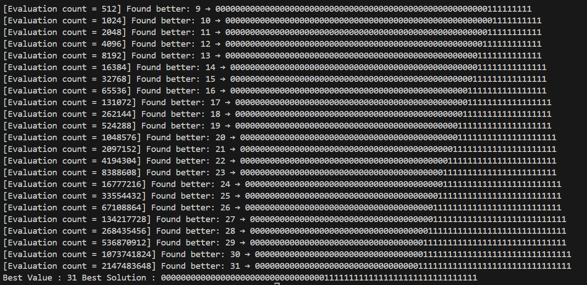
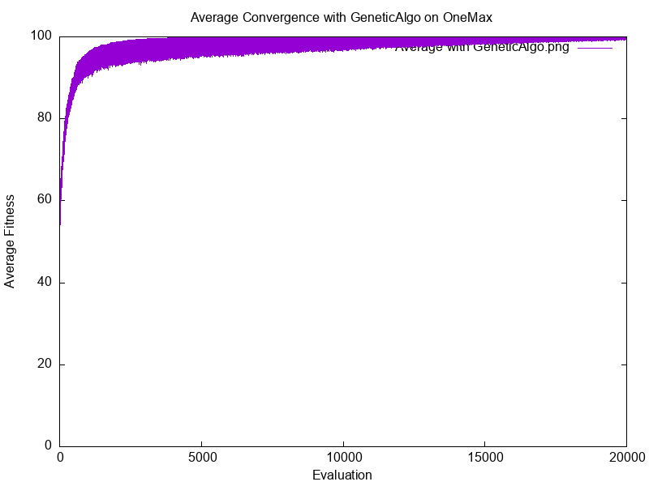
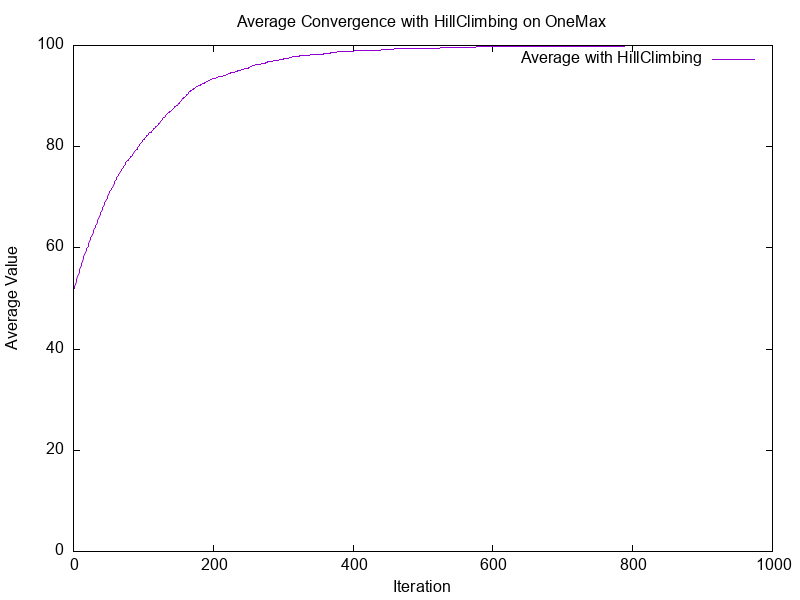
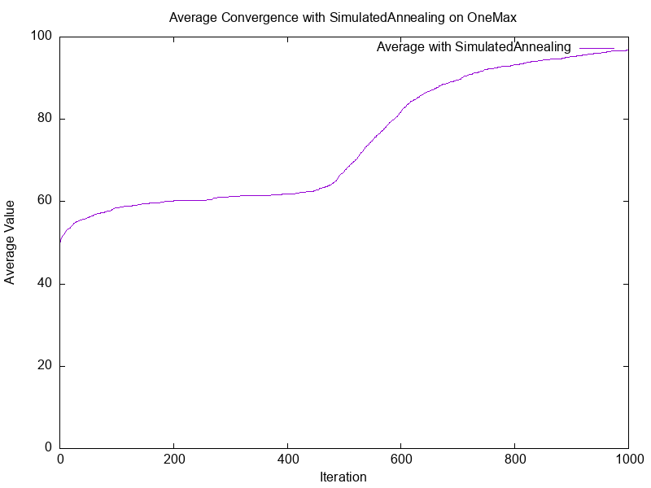
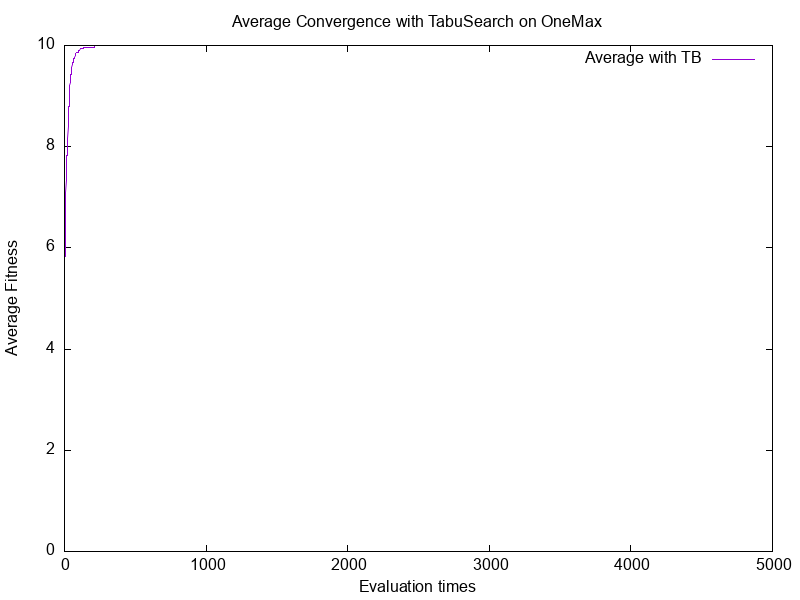

# Implement ExhaustiveSearch / HillClimbing / SimulatedAnnealing / GeneticAlgo / TabuSearch for Solving OneMax Problem

## ( I ) Introduction

- Language: C++
- Metaheuristic algorithms: Exhaustive Search (ES), Hill Climbing (HC), Simulated Annealing (SA), Genetic Algorithm (GA), Tabu Search (TB)
- Benchmark function: OneMax Problem
- Execution time: approximately 30 minutes total for all algorithms

## ( II ) Main Functionality

### `ExhaustiveSearch`

- `void RunALG(int bit)`\
  *Runs exhaustive search over all binary strings of length **``*
- `void Evaluation(const vector<int>& sol, int& value)`\
  *Calculates the fitness value of a solution*
- `void Reset()`\
  *Resets the counter for exhaustive enumeration*

### `HillClimbing`

- `void RunALG(int bit, int run, int iter)`\
  *Runs HC for specified number of runs and iterations*
- `vector<int> Init()`\
  *Generates a random initial solution*
- `vector<int> Neighbor(const vector<int>& best_sol)`\
  *Generates a neighbor by flipping one random bit*
- `void Evaluation(const vector<int>& sol, int& value)`\
  *Calculates fitness value of a solution*
- `void Reset()`\
  *Resets **``** counter per run*

### `SimulatedAnnealing`

- `void RunALG(int bit, int run, int iter)`\
  *Runs SA algorithm*
- `void Init(vector<int>& sol, int& value)`\
  *Generates a random initial solution*
- `vector<int> Neighbor(const vector<int>& sol)`\
  *Generates a neighbor by multi-bit mutation*
- `void Evaluation(const vector<int>& sol, int& value)`\
  *Calculates fitness value*
- `void T_cooldown(double& temp)` / `void T_reheat(double& temp)`\
  *Temperature schedule functions*
- `void Create_Vrecord(const string& filename, const vector<double>& content)`\
  *Creates record file for fitness values*

### `GeneticAlgo`

- `void RunALG(int bit, int run, int iter, int pop_size)`\
  *Runs GA*
- `void Init()`\
  *Initializes population of size **``*
- `void Select_Roulette()` / `void Select_Tournament()`\
  *Selection strategies*
- `void Mutation(vector<int>& child)`\
  *Applies adaptive mutation*
- `void Crossover_Unify(...)` / `void Crossover_Mask(...)`\
  *Two crossover methods: **``** for diversity, **``** for stability*
- `void Evaluation(...)`\
  *Evaluates fitness of child*
- `void Create_FitRecord(...)`\
  *Creates record file for fitness*

### `TabuSearch`

- `void RunALG(int bit, int run, int iter, int tabu_size, int tweak_num)`\
  *Runs Tabu Search*
- `vector<int> Init()`\
  *Initializes starting solution and best tracking*
- `vector<int> Tweak(const vector<int>& origin_sol)`\
  *Generates tweaked neighbors*
- `int Evaluation(const vector<int>& sol)`\
  *Computes OneMax fitness*
- `void Create_Record(const string& filename, const vector<T>& content)`\
  *Creates record file (templated for flexibility)*

## ( III ) Input

### Command-line arguments:

- **Binary Length:** `bit = (64 for ES / 100 for HC, SA, GA / 4 or 10 for TB)`
- **Number of Runs:** `run = (e.g., 30)`
- **Iterations Per Run:** `iter = (1000 for HC, SA, GA / 5000 for TB)`
- **Population Size:** `pop_size = (only for GA)`
- **Type of Algorithm** `algo_type = ES / HC / SA / GA / TB`
- For Tabu Search only:
  - **User Input:** `tabu_size = 5`
  - **User Input:** `tweak_num = 20`

## ( IV ) Output

### `HillClimbing`

- `values_of_run_1~30_HC.txt`
- `values_average_HC.txt`
- `plot_HC.plt`
- `result_OneMax_HillClimbing.png`

### `SimulatedAnnealing`

- `values_of_run_1~30_SA.txt`
- `values_average_SA.txt`
- `plot_SA.plt`
- `result_OneMax_SimulatedAnnealing.png`

### `GeneticAlgo`

- `fitness_of_run_1~30.txt`
- `fitness_average.txt`
- `plot_GA.plt`
- `result_OneMax_GeneticAlgo.png`

### `TabuSearch`

- `fitness_of_run_1~30_TB_bit_size_tweak.txt`
- `fitness_average_TB_bit_size_tweak.txt`
- `plot_TB.plt`
- `result_OneMax_TB_bit_size_tweak.png`

## ( V ) How to Compile and Run

### Compile

#### Visual Studio

1. Open Visual Studio project `OneMax.sln`
2. Press `Ctrl + F5` to build

#### VSCode

1. Open PowerShell or Windows CMD
2. Navigate to the correct directory
3. Compile with:

```bash
g++ main.cpp OneMax.cpp ExhaustiveSearch.cpp HillClimbing.cpp SimulatedAnnealing.cpp GeneticAlgo.cpp Tabu.cpp -o onemax.exe
```

### Run

1. Open PowerShell or CMD
2. Navigate to the folder
3. Run the program with:

```bash
.\onemax.exe bit run iter pop_size algo_type
```

Examples:

```bash
.\onemax.exe 100 30 1000 1 HC
.\onemax.exe 100 30 1000 1 SA
.\onemax.exe 100 30 1000 20 GA
.\onemax.exe 64 1 1 1 ES
.\onemax.exe 10 30 5000 0 TB
```

You will be prompted:

```
Please type tabu_size = (your input)
Please type tweak_num = (your input)
```

### Plot Results

1. Install gnuplot
2. Open CMD or PowerShell
3. Run with:

```bash
gnuplot plot_HC.plt
gnuplot plot_SA.plt
gnuplot plot_GA.plt
gnuplot plot_TB.plt
```

Output PNGs will appear in the working directory

## ( VI ) File Structure

```
onemax/
|
├── main.cpp
├── OneMax.cpp / OneMax.h
├── ExhaustiveSearch.cpp / ExhaustiveSearch.h
├── HillClimbing.cpp / HillClimbing.h
├── SimulatedAnnealing.cpp / SimulatedAnnealing.h
├── GeneticAlgo.cpp / GeneticAlgo.h
├── Tabu.cpp / Tabu.h
│
├── results/            ← output files (.txt, .png)
└── README.md           ← this file

```
## ( VII ) Experimental Results

### Exhausted Search for 64 bits Binary Length and Run 30 mins


### Genetic Algorithm for 100 bits Binary Length


### Hill Climbing for 100 bits Binary Length


### Simulated Annealing for 100 bits Binary Length


### Tabu Search for 10 bits Binary Length with Tabu List Size 5, Tweak 20 times



## ( VII ) Observations

- Exhaustive Search guarantees the global optimum but is only feasible for very small problem sizes.
- Hill Climbing is fast but easily stuck in local optima.
- Simulated Annealing introduces randomness and temperature decay to escape local optima.
- Genetic Algorithm balances exploration and exploitation well, especially with larger populations.
- Tabu Search effectively avoids cycling and revisiting previous solutions using a memory structure.

## ( VIII ) Key Features

- Object-oriented C++ implementation
- Unified interface for all metaheuristic algorithms
- Support for command-line parameter configuration
- Exportable performance records and convergence plots
- Compatible with gnuplot for automatic visualization

## ( IX ) Skills Demonstrated

- Metaheuristic algorithm design and implementation
- Modular software architecture in C++
- Fitness evaluation and neighbor generation
- Algorithm benchmarking and convergence comparison
- Parameter sensitivity analysis
- Shell-based automation and visualization scripting

